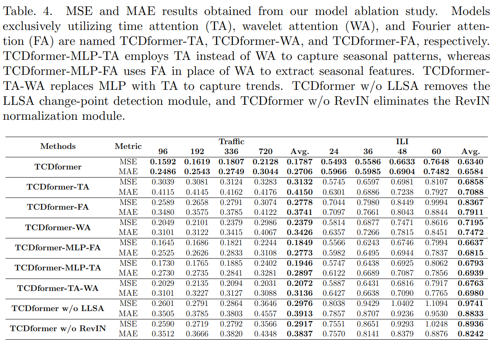

# TCDformer

### Dataset
We conducted experiments on benchmark time series prediction datasets, including ETTm2, Electricity, Exchange, Traffic, and Weather. A brief description is provided below:
#### (1) ETTm2 contains hourly time series data from power transformers, covering the period from July 2016 to July 2018, involving the removal of stabilizing factors and power load.
#### (2) Electricity features hourly electricity consumption for 321 customers from 2012 to 2014.
#### (3) Traffic includes hourly road occupancy rates measured by 862 sensors on San Francisco Bay Area highways, spanning from January 2015 to December 2016.
#### (4) Exchange features panel data of daily exchange rates for eight countries from 1990 to 2016.
#### (5) Weather consists of meteorological time series data with 21 indicators collected every 10 minutes in 2020 by the Max Planck Institute for Biogeochemistry.
#### (6) ILI compiles the ratio of reported flu-like illness cases to total cases reported weekly by the U.S. Centers for Disease Control and Prevention from 2002 to 2021.
ETTm2, electricity, and traffic datasets exhibit strong seasonality, whereas ILI, exchange, and weather datasets show less seasonality and more trend. Following standard protocols, we divided the datasets into training, validation, and test sets in chronological order, with a ratio of 6:2:2 for the ETT dataset and 7:1:2 for other datasets.
### Benchmarks models
We compared TCDformer with state-of-the-art attention models, including non-Stationary Transformer, TDformer, FEDformer, Autoformer, Informer, DLinear, and LSTNet. Classic models like ARIMA, RNN-based models, and CNN-based models, which exhibited significant errors in previous studies, are excluded from the comparison. For all real-world experiments, we used the past 96 time steps as context to predict the next 96, 192, 336, and 720 time steps, following prior works. We report the average MSE and MAE. The implementation was carried out using PyTorch on an NVIDIA GeForce RTX 3090 GPU server.
### Results
#### A. Comparing Attention Models

#### B. Comparison of Model Prediction Accuracy

#### C. Model Computational Complexity Analysis

#### D. Ablation Study
